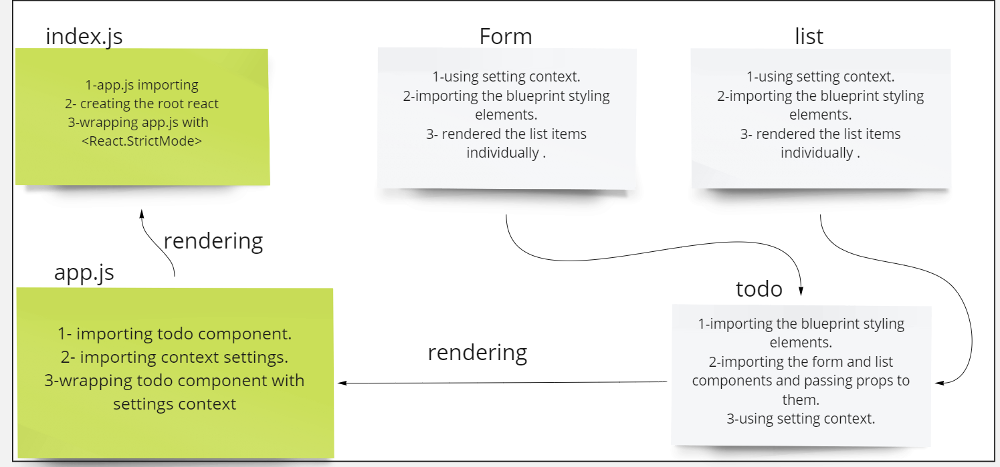

# TO Do App.

## **About the useForm component:**
  

* **it's a custom Hook that has multiple functions that handel submissions  used as forms .**

  

## UML Diagram :

# Links:

* [PR](https://github.com/ibrahimalaqoul/todo-app/pull/5)
* [APP LINK](https://peaceful-kitsune-0d4265.netlify.app/)
